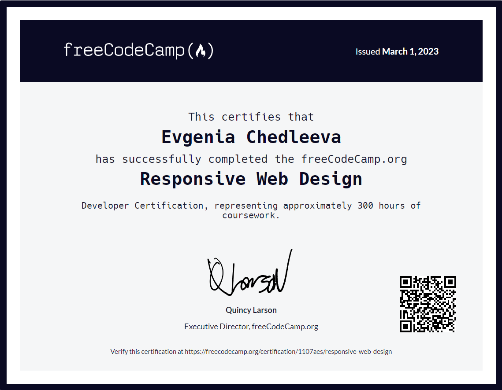

# CHEDLEEVA EVGENIA

### Contact information:
 <a href="https://github.com/evgeniachedleeva"></a> ___evgeniachedleeva___
___E-mail: ev.chedly@gmail.com___


### About me

I am very interested in learning frontend development. This is a fun and practical activity that gives you the opportunity to create beautiful and functional websites. I'm learning **HTML, CSS** and JavaScript and how they work together to create interactivity and dynamism on pages. I also study the principles of website design and learn how to create an attractive user interface that makes site navigation more intuitive and convenient. All this gives me the opportunity to improve my skills and expand my knowledge in this area, which can lead to better opportunities in a career as a web developer.

I started my journey in web development a couple of years ago and since then I have continued to deepen my knowledge and skills in this area. One source of learning was Freecodecamp, where I learned HTML and CSS. I not only learned the basic principles of web development, but also gained valuable experience with these languages in practice.

I am fond of **photography**.  Love taking pictures - to preserve what seems to me important, emotional, beautiful, unique.

My work is related to the **layout** of the newspaper. Each issue of the newspaper is like a new achievement in which I take an active part.


### Skills and Proficiency:
* HTML5, CSS3 (basic);
* Git, GitHub;
* VS Code;
* Adobe Photoshop, InDesign.

### Code example:

___Цикл While___
Создайте программу-таймер, которая будет принимать количество секнд в качестве входного параметкра, выводить оставшееся время и отсчитывать до 0.

```
Let num = parseInt(readLine(), 10);

while(num>=0) {
     console.log(num);
     num--;
}
```


### Courses:
* <a href="https://www.freecodecamp.org/learn">freeCodeCamp</a> (completed)



* Online lessons on youtube (HTML, SCC, JS) (in progress)
     * <a href="https://www.youtube.com/@ITDoctor">@ITDoctor</a>
* <a href="https://www.sololearn.com/">Sololearn app</a> (JS) (in progress)

### Languages:
* Russian - Native
* English basic